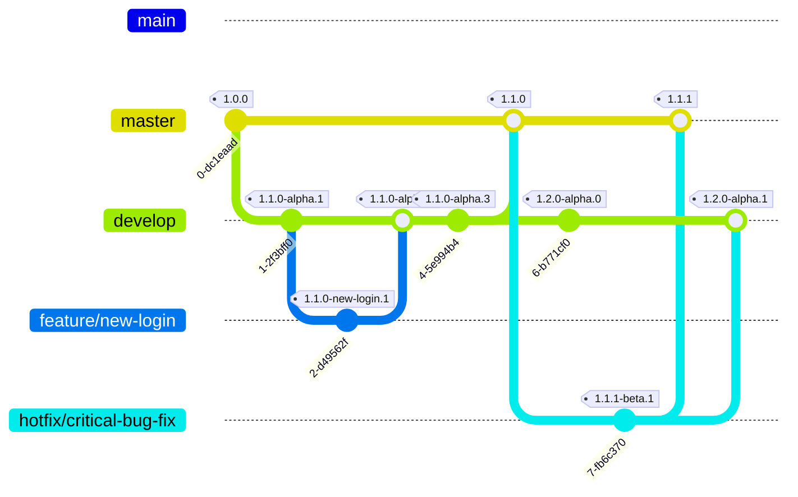

<div align="center">
  
  <h1>ZTR.BoardGame</h1>
  <p>Projekt małej gry interaktywnej z fizycznymi modułami (Raspberry Pi).</p>
</div>

Generowanie kluczy SSH
========

W przypadku wysyłania nowych wydań na serwer za pomocą SSH powinieneś używać kluczy.
Prosta instrukcja jak je generować jest tutaj: <https://wiki.mikr.us/uzywaj_kluczy_ssh/>

Krótko o projekcie
========

Projekt małej gry interaktywnej.

Instalacja/konfiguracji
========

## Instalacja na Raspberry Pi

1. Pobierz najnowszą wersję z Releases dla arm (https://github.com/MikDal002/ZTR.BoardGame/releases)
2. Skopiuj AppImage na Raspberry Pi (np. /home/pi/ lub /home/mikolaj/)
3. Skopiuj appsettings.json do tego samego katalogu
4. Nadaj uprawnienia:
   ```bash
   chmod +x /home/mikolaj/ZtrBoardGame.Console-linux-arm64-alpha.AppImage
   ```
5. Uruchom aplikację po raz pierwszy, aby ta skonfigurowała wszystko:
   ```bash
   sudo ./ZtrBoardGame.Console-linux-arm64-alpha.AppImage setup
   ```
5. Sprawdź podłączone moduły:
   ```bash
   sudo apt update
   sudo apt install i2c-tools
   i2cdetect -y 1
   ```
   Powinieneś zobaczyć coś takiego:
   ```text
        0  1  2  3  4  5  6  7  8  9  a  b  c  d  e  f
   00:                         -- -- -- -- -- -- -- --
   10: -- -- -- -- -- -- -- -- -- -- -- -- -- -- -- --
   20: -- 21 22 -- 24 -- 26 -- -- -- -- -- -- -- -- --
   30: -- -- -- -- -- -- -- -- -- -- -- -- -- -- -- --
   40: -- -- -- -- -- -- -- -- -- -- -- -- -- -- -- --
   50: -- -- -- -- -- -- -- -- -- -- -- -- -- -- -- --
   60: -- -- -- -- -- -- -- -- -- -- -- -- -- -- -- --
   70: -- -- -- -- -- -- -- --
    ```

    W tym przykładzie widzimy, że podłączone są moduły o adresach 0x21, 0x22, 0x24 i 0x26.
6. Skonfiguruj appsettings.json:
   ```json
   "PhysicalBoardSettings": {
        // You can find your addresses using i2cdetect -y 1
        "Addresses": [ "0x21", "0x22", "0x24", "0x26" ],
        "InterruptPinNumber": 4
      },
   ```
7. Upewnij się, że gra działa w trybie offline:
   ```bash
   sudo ./ZtrBoardGame.Console-linux-arm64-alpha.AppImage board run --no-server
   ```
8. Od tego momentu gra powinno uruchomić się automatycznie po starcie w trybie serwerowym.
9. Skonfiguruj niezbędne rzeczy, jak adresy w appsettings.json:
   ```json
   "BoardNetworkSettings": {
    "PcServerAddress": "http://pcmr.local:5000",
    "BoardAddress":  "http://raspberrypi03:5000"
   }
   ```

## Utworzenie niezależnej sieci lokalnej WiFi na Raspberry Pi

Jeśli chcesz, aby Raspberry Pi działało jako samodzielna jednostka bez dostępu do internetu, możesz skonfigurować je jako punkt dostępowy WiFi. Poniżej znajdziesz kroki, jak to zrobić:

1. Tutaj jest tutorial jak to skonfigurować szybko i wygodnie: <https://www.tomshardware.com/how-to/raspberry-pi-access-point>.
2. Oznacz jedno raspberry pi, jako master, a wszystkie pozostałe skonfiguruj w ten sposób, aby się z nim łączyły automatycznie. Niestety, aby to dobrze działało, musisz usunać wszystkie inne znane sieci. Bo gdy RPi połączy się np. z twoją siecią domową, to nie będzie próbowało połączyć się z masterem.

Takie rzeczy najwygodniej robić przez VNC. Aby je włączyć:

1. po połączniu przez SSH: `sudo raspi-config`.
1. Następnie opcja `(3) Interface Options` -> `(I3) VNC` -> `Yes`.
1. Można łączyć się od razu, przez np. **RealVNC Viewer**.

Aby ustawić auto połącznie:

1. Wybierz sieci po prawej u góry ekranu,
1. Na samym dole `Advenced Options` -> `Edit Connections`.
1. W nowym oknie o nazwie "Network Connections" upewnij się, że nie ma nic, co najwyżej `Wired Connection 1` (to jest połaczenie przewodowe).
1. Kliknij `+` na dole po lewej. W oknie "New Connection" wybierz `Wireless` i kliknij `Create...`.
1. Uzupełnij niezbędne dane do połącznia,
   - W zakłądce "Wireless":
     - SSID: `raspberrypi03`
   - W zakładce "Wireless Security":
     - Security WPA3 Personal
     - i hasło `raspberrypi03`.
   - W zakładce "General":
     - upewnij się, że zaznaczone jest "Connect automatically with priority".
1. Kliknij `Save` i zamknij okno "Network Connections".

## Konfiguracja serwera

1. Ustaw nazwę komputera, na którym znajduje się serwer na PCMR.
2. Pobierz najnowszą wersję z Releases dla windows (https://github.com/MikDal002/ZTR.BoardGame/releases)
3. Uruchom ściągniętą aplikację.
4. Dostosuj appsettings.json (np. ten: <https://github.com/MikDal002/ZTR.BoardGame/blob/release/src/ZtrBoardGame.Console/appsettings.json,> dodaj wpis `"urls": "http://0.0.0.0:5000"` .
5. Uruchom aplikacje `pc run`

## Zasoby projektu

- <https://github.com/Dotnet-Boxed/Templates/> - w tym projekcie są fajnie rozwinięte projekty aplikacji serwerowych (API, GraphQL, Orleans)

## Zewnętrzne zasoby

- <https://github.com/dotnet/templating/wiki/Available-templates-for-dotnet-new> - lista różnych projektów z szablonami

## Wersjonowanie

This project uses a GitFlow-inspired branching model, automated with GitVersion. This ensures consistent versioning and a clear workflow for development, features, and fixes.

**Main Branches:**

- **`master`**:* **`master`**:
    - Represents the production-ready state of the project.    * Represents the production-ready state of the project.
    - Commits are typically merges from `develop` (for releases) or `hotfix` branches.    * Commits are typically merges from `develop` (for releases) or `hotfix` branches.
    - **Versioning (GitVersion):**    * **Versioning (GitVersion):**
        - Format: `Major.Minor.Patch` (e.g., `1.0.0`, `1.1.0`, `1.1.1`).        * Format: `Major.Minor.Patch` (e.g., `1.0.0`, `1.1.0`, `1.1.1`).
        - `increment: Patch` (though the version is usually determined by the branch being merged).        * `increment: Patch` (though the version is usually determined by the branch being merged).
        - `tag: ''` (no pre-release tag).        * `tag: ''` (no pre-release tag).

- **`develop`**:* **`develop`**:
    - Serves as the main integration branch for new features. All feature branches are merged into `develop`.    * Serves as the main integration branch for new features. All feature branches are merged into `develop`.
    - When `develop` is stable and ready for a release, it's merged into `master`.    * When `develop` is stable and ready for a release, it's merged into `master`.
    - **Versioning (GitVersion):**    * **Versioning (GitVersion):**
        - Format: `Major.Minor.Patch-alpha.Commits` (e.g., `1.1.0-alpha.1`, `1.2.0-alpha.5`).        * Format: `Major.Minor.Patch-alpha.Commits` (e.g., `1.1.0-alpha.1`, `1.2.0-alpha.5`).
        - `increment: Minor` (advances the minor version based on `master` due to `track-merge-target: true`).        * `increment: Minor` (advances the minor version based on `master` due to `track-merge-target: true`).
        - `tag: alpha`.        * `tag: alpha`.

**Supporting Branches:**

- **`feature/*`** (e.g., `feature/new-user-auth`):* **`feature/*`** (e.g., `feature/new-user-auth`):
    - Typically branched from `develop` for new development work, but can also originate from `main` or `master` if needed.    * Typically branched from `develop` for new development work, but can also originate from `main` or `master` if needed.
    - Merged back into `develop` upon completion.    * Merged back into `develop` upon completion.
    - **Versioning (GitVersion):**    * **Versioning (GitVersion):**
        - Format: `InheritedBaseVersion-BranchName.Commits` (e.g., `1.1.0-new-user-auth.3` if branched from `develop` at `1.1.0-alpha.x`).        * Format: `InheritedBaseVersion-BranchName.Commits` (e.g., `1.1.0-new-user-auth.3` if branched from `develop` at `1.1.0-alpha.x`).
        - `increment: Inherit`.        * `increment: Inherit`.
        - `tag: use-branch-name`.        * `tag: use-branch-name`.

- **`hotfix/*`** (e.g., `hotfix/critical-security-patch`):* **`hotfix/*`** (e.g., `hotfix/critical-security-patch`):
    - Branched from `master` to address urgent production issues.    * Branched from `master` to address urgent production issues.
    - Merged back into both `master` (to release the fix) and `develop` (to ensure the fix is in future development).    * Merged back into both `master` (to release the fix) and `develop` (to ensure the fix is in future development).
    - **Versioning (GitVersion):**    * **Versioning (GitVersion):**
        - Format: `MasterBaseVersion.PatchIncrement-beta.Commits` (e.g., `1.1.1-beta.1` if `master` was `1.1.0`).        * Format: `MasterBaseVersion.PatchIncrement-beta.Commits` (e.g., `1.1.1-beta.1` if `master` was `1.1.0`).
        - `increment: Patch`.        * `increment: Patch`.
        - `tag: beta`.        * `tag: beta`.

**Workflow Diagram:**



**`GitVersion.yml` Configuration:**

The versioning is controlled by the [`GitVersion.yml`](GitVersion.yml:1) file. The key aspects are reflected in the branch descriptions above.
The final confirmation and potential adjustments to this file are tracked in GitHub Issue [#44](https://github.com/MikDal002/ZTR.Templates/issues/44).

---
*This documentation is related to GitHub Issue [#44](https://github.com/MikDal002/ZTR.Templates/issues/44): Define and Document Branching Strategy & GitVersion Configuration.*

## Raspberry PI I2C Debugging

This section provides a collection of useful commands for debugging I2C communication on a Raspberry Pi.

### Listening for Interrupts

To monitor a specific GPIO pin for a falling edge interrupt, which is useful for detecting signals from a connected chip, use the `gpiomon` tool. The following command listens on `gpiochip0` at pin `4`:

```bash
gpiomon --falling-edge gpiochip0 4
```

### Turning On All Ports

For testing purposes, you can activate all I/O ports on an I2C device. The command below sends a signal to the device at address `0x20` on I2C bus `1`, setting all ports to high:

```bash
i2cset -y 1 0x20 0xff 0xff
```

### Discovering Device Addresses

To scan for all connected devices on a specific I2C bus, you can use `i2cdetect`. This is essential for verifying that your devices are correctly connected and recognized by the Raspberry Pi.

The following command will display a table of all detected devices on I2C bus `1`:

```bash
i2cdetect -y 1
```

### Reading from an I2C Device

To read a word (two bytes) from a specific register of an I2C device, use the `i2cget` command. This is useful for checking the state or value of a device's internal registers. The `w` parameter at the end of the command specifies that a word should be read.

The following command reads a word from a device at address `0x20` on I2C bus `1` at register `0x00`:

```bash
i2cget -y 1 0x20 0x00 w
```